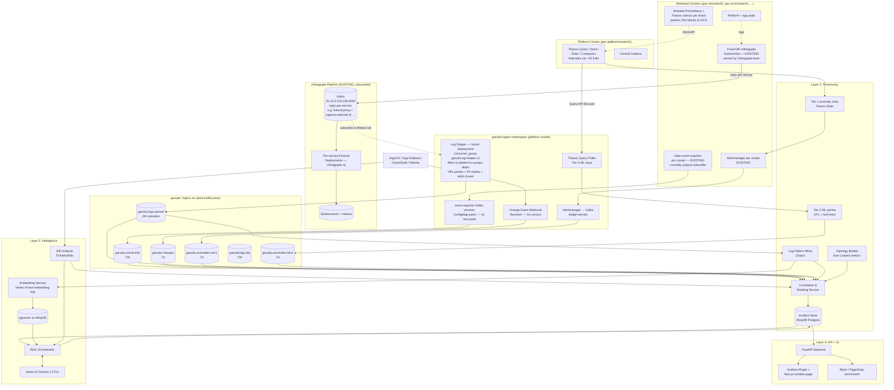

# Garuda — AI-Assisted Observability and Incident Reasoning System


**Owner:** Hrishabh Joshi (hrishabh.joshi@myntra.com)


---

## 1. Guiding Principles

Three principles drive every decision:

1. **Read-mostly on existing stack.** Prometheus/Thanos is production-critical. Garuda consumes from it (via the Thanos Query API and targeted `remote_write` taps). No re-scraping.
2. **Bounded LLM exposure.** Raw logs and metrics never reach an LLM. Only curated, summarized, symbolic context. Every token is deliberate — pattern mining, clustering, and correlation happen in deterministic code first.
3. **Incident-centric data model.** The unit of work is an `Incident` — a correlated bundle of (anomaly + change events + log patterns + topology slice). Everything either creates, enriches, or displays an Incident.

---

## 2. Cluster Topology (Myntra Current State)

- **Primary DC (`ci`) / Secondary DC (`si`).** Cluster naming encodes DC: `pac-*` = primary CI, `pas-*` = secondary SI.
- **Platform clusters** — `pac-platformcluster01`, `pac-platformcluster02` (primary), `pas-platformcluster02` (secondary). Host the central Thanos Query, central Grafana (`grafana-k8s-ci.myntra.com`), and will host the Garuda control plane. Thanos Query federates across workload clusters via ~40+ per-shard internal ILBs (StoreAPI gRPC).
- **Workload clusters (~30 total).** Each runs four sharded `Prometheus` CRs (`apps-prom` × 9 shards, `system-prom` × 10, `ingress-prom`, `linkerd-prom`), each with Thanos sidecar pushing 15-minute blocks to cloud storage. Local TSDB retention is 10 days. Categories:
  - **Storefront:** `pac-sfcluster01`, `pac-sfcluster02`
  - **SCM:** `pac-scmcluster01`, `pac-scmcluster02`, `pas-scmcluster01`
  - **DPE / ML / BI:** `pac-dpecluster01`, `pac-mlpcluster01`, `pac-bicluster01`, `aksmlpprodcluster01`
  - **Misc:** `pac-stagecluster01`, and others
- **Logging pipeline (chitragupta, EXISTING).** Fluent Bit (custom Myntra build `fluent-bit-chitragupta-2.0.6:v1` in `se` namespace) on every node → Kafka brokers on `10.12.0.219-230:9092` → per-service Fluentd Deployments in `chitragupta` namespace → Elasticsearch (+ Azure Blob archival for `mdp` department). Topic-per-service; message metadata is `Env`, `Dept`, `LogshipperPod`, `KubeNode` (no `Cluster` label — see §4.2).
- **Kafka reality — two candidate clusters.**
  - *chitragupta Kafka* (self-hosted, 12 brokers on `10.12.0.0/24`) — already carries every service's logs, zero-egress for Garuda inside CI.
  - *Observability-project Kafka* (GCP) — referenced in earlier conversations; actual deployment state TBC. May or may not still be the plan for Garuda's own topics.
  - **Working decision:** Garuda consumes logs from chitragupta Kafka and (provisionally) publishes its own output topics (`garuda.*`) to the same cluster, pending confirmation from the Kafka admin team. One cluster = fewer moving parts for Milestone 1.

## 3. Architecture Diagram



---

## 4. Layer 1 — Data Ingestion (Revised for Myntra Topology)

Goal: observation without interference. Maximally reuse existing Fluent Bit, Kafka, Thanos, and Alertmanager.

### 4.1 Metrics — No New Remote Write Path

Constraint: sfcluster and scmcluster push metrics to GCS via Thanos sidecar; there is no cross-cluster federation other than Thanos Query (StoreAPI). We avoid adding new `remote_write` paths in Milestone 1.

**Tier 1 anomaly detection = Thanos Ruler recording rules + Alertmanager webhook.** All anomaly rules live on the platform cluster's Thanos Ruler, evaluated against the fully federated Thanos Query view. Rules fire via existing Alertmanager → a small **Alertmanager → Kafka bridge** (webhook receiver) publishes to `garuda.anomalies.tier1`. Zero new data paths from workload clusters.

**Tier 2 ML anomaly detection = polling Thanos Query.** A worker in the platform cluster hits Thanos Query every 60s for the curated SLI set (~50–150 series), runs ML detectors (STL baseline + online isolation forest) in memory, emits to `garuda.anomalies.tier2`.

**Historical pull for investigation** — same Thanos Query API, wider time windows.

**Latency note:** Thanos sidecar GCS uploads are every 2h by default, but Thanos Query queries sidecars *directly via StoreAPI gRPC* for recent data, giving sub-minute freshness. Confirm sidecar reachability from Thanos Query over the observability VPC.

If we ever need sub-10s latency on specific critical SLIs, add targeted `remote_write` from workload-cluster Prometheus for just those series. Not needed for Milestone 1.

### 4.2 Logs — Consume the Existing chitragupta Kafka

**Constraint (from `03-chitragupta-logging-findings.md`):** Every service's logs already flow through chitragupta Kafka (`10.12.0.219-230:9092`) on a topic-per-service basis. Fluent Bit is the Kafka *producer*, Fluentd is the consumer that writes to Elasticsearch. The smart move is not to modify Fluent Bit but to stand up *another* consumer next to Fluentd, reading only the topics we care about.

**Why consumer-side, not producer-side:**
- Fluent Bit configs are generated from Zion and re-templated by the chitragupta team. Our changes would be blown away on every ansible run unless we own a template fork — which we don't want.
- Custom `chitragupta` Fluent Bit image has 24Gi memory already; adding Kafka-output-with-Lua-PII-masking is mostly fine, but PII regex changes require a DaemonSet roll on every cluster. Slow iteration.
- Consumer-side we own deployment cadence, can roll parsing changes in minutes, and the blast radius is zero — if Garuda's shaper crashes, the chitragupta pipeline keeps running.

**Component: Log Shaper (Vector Deployment, `garuda-ingest` namespace, platform cluster).**

1. **Topic discovery via Zion.** A Python job (`zion-fetch.py`) queries the Zion GraphQL endpoint (`http://ziondb.myntra.com/graphql`) filtered by `team.department.name IN ('platforms','sysops')`, plus a curated allowlist for things like `ingress-*-sf`, `ingress-*-scm`, `linkerd-proxy-*`, `haproxy-ingress-*`. Output: a versioned YAML (`garuda-topics.yaml`) committed to git and mounted as a ConfigMap. Regenerated nightly via CronJob; PR diff gates topic additions.
2. **Subscription.** Vector's `kafka` source subscribes to the topics listed in `garuda-topics.yaml`, bootstrap = the 12 chitragupta broker IPs, `consumer_group = garuda.log-shaper.v1` (explicitly *not* matching chitragupta's `{service}_{env}` pattern — see §4.5).
3. **VRL transforms (in order):**
   - **Filter** — drop messages whose `Dept` is not in `{sysops, platforms}` (defense in depth against topic discovery drift).
   - **Parse** — dispatch on source format:
     - Linkerd proxy logs (plain text, key=value) → `parse_logfmt`
     - HAProxy access logs → `parse_regex` with the standard HAProxy pattern
     - JSON envelopes (most app logs) → `parse_json`
     - Multi-line Java stack traces → already joined by Fluent Bit's `multiline.parser java`; Vector just preserves
   - **Cluster inference** — read incoming `Cluster` record if present (post producer-side fix, see §4.2.1), else derive from `KubeNode` hostname pattern via a lookup table (short-term workaround).
   - **PII mask** — VRL `replace()` for emails, phone (+91 / 10-digit), PAN (`[A-Z]{5}[0-9]{4}[A-Z]`), Aadhaar (`\d{12}`), CVV (3–4 digit near `cvv`/`cvv2`). This happens *before* any further enrichment and *before* any embedding.
   - **Normalize** — emit schema in §8.X (`timestamp`, `cluster`, `namespace`, `pod`, `container`, `service`, `severity`, `message`, `labels`, `source_topic`).
   - **DLQ branch** — unparseable messages routed to `garuda.logs.dlq`.
4. **Publish.** Vector's `kafka` sink writes to `garuda.logs.parsed` on the same brokers, `compression = zstd`, `acks = 1` (we tolerate occasional loss; we're not a billing system).
5. **Scale / ops.** Deployment with HPA on CPU + Kafka lag. Start with 3 replicas consuming 5–10 pilot topics (Linkerd variants + ingress variants); widen subscription after pipeline stability proven. Expose `vector_component_received_events_total` / `vector_component_sent_events_total` for our own SLOs.

#### 4.2.1 Producer-side ask: Record Cluster

The chitragupta Fluent Bit `record_modifier` filter currently adds `Env`, `Dept`, `LogshipperPod`, `KubeNode` but **not `Cluster`**. Since multiple clusters publish to the same topic (e.g. every cluster with `linkerd-proxy-foo` running will publish to topic `linkerd-proxy-foo`), messages cannot be attributed to a cluster without a fragile `KubeNode → cluster` lookup.

We ask the chitragupta team for a one-line template change in `roles/fluentbit/k8s/generate-config/templates/app_template_*.conf.j2` and `ingress_template.conf.j2`:

```diff
 [FILTER]
     Name record_modifier
     Match {{ service_name }}.*
     Record LogshipperPod ${HOSTNAME}
     Record KubeNode ${MY_NODE_NAME}
     Record Env {{ env }}
     Record Dept {{ department }}
+    Record Cluster {{ cluster }}
```

`cluster` is already iterated at config generation time (per-cluster datastore layout). Low risk, broadly useful. Until this ships, the shaper maintains a `KubeNode hostname pattern → cluster` lookup table as a workaround.

#### 4.2.2 What this design deliberately avoids

- No new DaemonSet on workload nodes.
- No modification to existing Fluent Bit `INPUT`/`FILTER`/`OUTPUT` blocks (apart from the one optional `Record Cluster` addition, which is chitragupta's to ship).
- No subscribing to every topic in the chitragupta firehose — strictly `platforms + sysops` scope, widened by explicit allowlist.
- No consumer group name collision with chitragupta's `{service}_{env}` naming scheme.
- No second Elasticsearch fan-out — if we ever need to search raw logs for an investigation, we hit the existing chitragupta Kibana.

### 4.3 K8s Events

`resmoio/kubernetes-event-exporter` is already deployed per workload cluster in the `monitoring` namespace (bound to ClusterRole `view`). Current config routes only to `stdout` and `file` — nothing useful for Garuda.

**Change:** patch the `event-exporter-cfg` ConfigMap on each cluster to *add* a `kafka` receiver alongside the existing stdout/file (keep existing behaviour, additive only). Publishes to `garuda.events.k8s` with the cluster name in a message header (from the exporter's `clusterName` config). Capture both `Warning` and `Normal` kinds — `Normal` events (`Scheduled`, `Pulled`, `Started`) are essential for reconstructing deployment timelines and correlating to ArgoCD syncs.

Zero new workloads. Just a ConfigMap edit + pod restart per cluster.

### 4.4 Change Events

Single **Go webhook receiver** service deployed in the platform cluster, exposed via internal ingress. Endpoints for ArgoCD notifications, Cloud Build, GitHub, Atlantis. Normalizes every incoming webhook to canonical `ChangeEvent` schema (see §7.1) and publishes to `garuda.changes`. Terraform plans pulled from Atlantis plan artifact store to get actual resource diffs, not just "plan applied".

### 4.5 Transport — Reuse chitragupta Kafka for Everything

**Decision:** publish Garuda's own topics to the same chitragupta Kafka cluster, pending confirmation from the Kafka admin team. Rationale:

- Log input is already there — splitting input vs. output across two clusters would force every downstream Garuda component to speak to two brokers for no benefit.
- chitragupta Kafka is Myntra-internal (`10.12.0.0/24`), so reach from CI clusters is already solved at the network layer (this is the everyday case for chitragupta itself).
- Avoids the "observability project Kafka" unknown — we may never need it.

If capacity or ACL isolation concerns arise, we can migrate Garuda-owned topics to a separate cluster later without changing the consumer contract — only the bootstrap URL and credentials change.

**Topics to create** (prefix `garuda.` — namespace-owned, retention bounded, dropped independently of chitragupta's topics):

| Topic | Partitions | Retention | Producer | Notes |
|---|---|---|---|---|
| `garuda.logs.parsed` | 24 | 24h | Log Shaper (Vector) | Only `platforms`+`sysops` scope |
| `garuda.logs.dlq` | 3 | 72h | Log Shaper | Unparseable lines for triage |
| `garuda.events.k8s` | 6 | 72h | event-exporter (per cluster) | Kafka receiver added to existing ConfigMap |
| `garuda.changes` | 3 | 7d | Webhook receiver | ArgoCD/Argo Rollouts/Cloud Build/Atlantis |
| `garuda.anomalies.tier1` | 3 | 7d | Alertmanager → Kafka bridge | Thanos-Ruler-driven |
| `garuda.anomalies.tier2` | 3 | 7d | ML worker | STL + IsoForest on SLI stream |

Note: **no `garuda.logs.raw`** — the chitragupta per-service topics *are* our raw stream. Parsing happens in the shaper; only the parsed output is a Garuda-owned topic.

**Cross-cluster networking.** Workload-cluster `event-exporter` and per-cluster `alertmanager-kafka-bridge` need to reach the chitragupta brokers. The chitragupta pipeline already does this in CI — so CI-resident clusters are fine. Confirm path for `pas-*` (SI) clusters and for any GCP-native clusters that aren't on the 10.12.0.0/24 VLAN.

**Kafka auth.** Generated Fluent Bit configs don't set SASL args, suggesting plaintext-on-VPC today. Before Milestone 1 closes, confirm whether Garuda should stay on that posture or use SASL/SCRAM (we'd prefer SCRAM + ACLs restricting `garuda.log-shaper.v1` to *read-only* on subscribed topics and *write* on `garuda.*`).

---

## 5. Layer 2 — Processing Engine

Turn streams into signals.

### 4.1 Anomaly Detection (Two-Tier)

**Tier 1 — Deterministic (Prometheus recording rules):**
- Burn-rate alerts on SLO budgets
- Z-score on 5-minute rolling windows via `quantile_over_time`
- MAD (median absolute deviation) for noisy counters

Cheap, interpretable, catches 70%+ of real incidents. Fires `garuda_anomaly_detected{...}` alert to Alertmanager, which webhooks Garuda.

**Tier 2 — ML worker (Python, Flink PyFlink or GKE deployment), runs every 60s:**
- Per-series state: STL seasonal decomposition baseline (refreshed hourly)
- Online isolation forest for multivariate detection across correlated metrics (e.g. apiserver latency + etcd fsync duration)
- Start with `scikit-learn` + `statsforecast`; outgrow → `PyOD` or managed service

Output shape always: `AnomalySignal` records written to incident store with confidence 0–1.

### 4.2 Log Pattern Mining

Run **Drain3** (streaming log template extraction) on the log topic. Collapses millions of raw lines into hundreds of templates per service, each with count + last-seen. Track *deltas* — templates whose frequency changed sharply, or entirely new templates appearing after a deploy.

**Only template deltas enter the incident — never raw logs.** Single biggest lever on LLM cost.

### 4.3 Topology Builder

Linkerd's per-pod metrics (`response_total{direction, dst_*}`) give a live service graph. Go controller materializes this as a directed weighted graph in Redis (edge weight = req/s, refreshed every 30s). When a service is anomalous, walk upstream/downstream N hops to pull correlated signals — "topological proximity" in the ranking.

### 4.4 Correlation + Ranking

Python service triggered by an anomaly. Pulls window `[anomaly_start - 30m, anomaly_start + 5m]`. Scores candidate causes:

```
score(c) = w1·f_time(Δt) + w2·f_topo(d) + w3·f_hist(c) + w4·f_kind(c)
```

- `f_time` — exponential decay with time distance from anomaly onset
- `f_topo` — rewards causes on same / upstream service in Linkerd graph
- `f_hist` — rewards causes historically associated with this anomaly signature (learned from Layer 3 feedback)
- `f_kind` — prior on change type (TF apply > config-map edit > log template shift)

Start with hand-tuned weights (0.4, 0.3, 0.2, 0.1). Instrument for later tuning — **do not ML this on day one.**

### 4.5 Output

Each anomaly becomes an `Incident` row in AlloyDB Postgres with ranked candidate causes. Only top N (N=5) candidates proceed to Layer 3 — bounds LLM cost.

---

## 6. Layer 3 — Intelligence Layer

**Core insight:** the LLM is an *explainer and synthesizer*, not a detector. Layer 2 has already picked the 5 likely causes by the time context reaches Gemini. The LLM ranks, explains, and suggests remediation.

### 5.1 Diff Analyzer

Deterministic Go service consuming change events:
- **Terraform** — parse `terraform show -json`, extract resource-level diffs with before/after for changed attributes
- **Helm** — diff rendered manifests (`helm template` before vs after), surface only changed keys
- **Raw K8s** — three-way merge diff on live-vs-last-applied

Never pass full manifests to the LLM. Pass structured summaries:
> *Deployment `linkerd-proxy-injector`: container.resources.limits.memory 250Mi → 500Mi; replicas 3 → 2.*

### 5.2 Embeddings and RAG

Vector store: **pgvector on the same AlloyDB instance** as the incident store. One database to operate, transactional joins between incidents and embeddings.

Embed at three granularities:
- **Log templates** (Drain3 patterns, embedded once, reused) — "have we seen this log before?"
- **Past incident summaries** — "what did we do last time this happened?"
- **Runbook chunks + service catalog entries** — remediation retrieval

Model: **Vertex AI `text-embedding-005`** (768-dim) — cheap, good for technical text.

### 5.3 RAG Retrieval for Active Incident

1. Embed incident's anomaly description + top log templates
2. Retrieve top-3 similar past incidents (cosine similarity, filtered `resolved=true`)
3. Retrieve top-3 runbook chunks matching affected service + signal type
4. Fetch parsed diff summary for each ranked candidate cause
5. Assemble into prompt

### 5.4 LLM Selection

- **Primary:** Vertex AI Gemini 1.5 Pro — long context, good K8s/IaC knowledge, in-region on GCP (compliance)
- **Fallback:** Claude Sonnet via Vertex AI Model Garden for reasoning-heavy cases (A/B on sampled set)
- Avoid out-of-GCP endpoints given Myntra's DLP constraints

### 5.5 Prompt Chain (Three Hops)

1. **Summarizer** (Gemini Flash) — condense log templates + metric shape into 2-3 sentences
2. **Hypothesis generator** (Gemini 1.5 Pro) — summary + ranked candidates + retrieved context → ranked hypotheses with confidence + reasoning. Structured JSON output via response schema.
3. **Remediation drafter** (Gemini Flash) — top hypothesis + runbook snippets → safe, specific remediation steps

---

## 7. Layer 4 — API + UI

### 6.1 Backend API

FastAPI on GKE (async, great for fan-out to Postgres + Vector Search + LLM).

Endpoints:
- `GET /incidents`
- `GET /incidents/{id}`
- `POST /incidents/{id}/analyze` — manual re-trigger
- `POST /incidents/{id}/feedback` — SRE marks cause correct/incorrect (feeds historical weight)
- `GET /incidents/{id}/timeline`

Auth via Google IAP in front of ingress. Service-to-service auth with Workload Identity.

### 6.2 UI — Two Surfaces

- **Grafana plugin** (datasource + panel) — incident timeline inside the tool SREs already use. Shows metrics (embedded from existing Grafana), overlaid with change events, K8s events, log-pattern spikes.
- **Next.js standalone incident page** — deeper LLM reasoning view, ranked hypotheses with expandable evidence, diff viewer for IaC changes, "was this useful?" feedback buttons.

### 6.3 Notifier

On incident create with `confidence > 0.7`, post to dedicated Slack channel with LLM summary + top hypothesis + UI link.

PagerDuty integration only as *enrichment* to existing alerts — add a "Garuda analysis" link to the PD incident. **Do not page on our own until FP rates proven in shadow mode.**

---

## 8. Data Schemas

### 8.1 Canonical `ChangeEvent` (Kafka)

```json
{
  "event_id": "uuid",
  "event_type": "deploy | tf_apply | config_change | rollback",
  "source": "argocd | cloudbuild | atlantis | github",
  "ts": "2026-04-19T09:12:03Z",
  "actor": "hrishabh.joshi@myntra.com",
  "target": {
    "kind": "Deployment",
    "namespace": "linkerd",
    "name": "linkerd-proxy-injector",
    "cluster": "prod-gke-asia-south1"
  },
  "git": { "repo": "myntra/platform-k8s", "sha": "a3f...", "pr": 4421 },
  "diff_ref": "gs://garuda-diffs/2026/04/19/abc.json",
  "raw_payload_ref": "gs://garuda-raw/..."
}
```

### 8.2 Incident Context to LLM (Hypothesis Generator)

```json
{
  "incident_id": "INC-2026-04-19-0003",
  "cluster": "prod-gke-asia-south1",
  "anomaly": {
    "signal": "linkerd_proxy_response_total{status=~'5..'} rate spike",
    "metric": "linkerd_proxy_response_total",
    "service": "checkout-api",
    "started_at": "2026-04-19T09:14:22Z",
    "severity": "high",
    "baseline": { "p50_rps": 12.3, "p99_rps": 45.1 },
    "observed":  { "p50_rps": 183.0, "p99_rps": 412.5 },
    "duration_so_far_s": 240
  },
  "topology": {
    "affected_service": "checkout-api",
    "upstream_callers":  ["web-bff", "mobile-bff"],
    "downstream_deps":   ["payments-api", "inventory-api", "redis-cart"]
  },
  "log_pattern_deltas": [
    {
      "service": "checkout-api",
      "template": "upstream connect error or disconnect/reset before headers. reset reason: <*> transport failure reason: <*>",
      "count_before": 3, "count_after": 1842,
      "example_fields": { "reset_reason": "connection_timeout", "upstream": "payments-api:8080" }
    },
    {
      "service": "linkerd-proxy",
      "template": "failed to proxy request: operation timed out after <*>",
      "count_before": 0, "count_after": 241
    }
  ],
  "ranked_candidate_causes": [
    {
      "rank": 1, "score": 0.82, "kind": "deploy",
      "change_event_id": "ce-88af",
      "summary": "ArgoCD sync of payments-api v2.41.0 at 09:12:05 (T-137s)",
      "diff_summary": "Deployment payments-api: env.DB_POOL_SIZE 50->10; resources.limits.cpu 2->1"
    },
    {
      "rank": 2, "score": 0.41, "kind": "tf_apply",
      "change_event_id": "ce-91bc",
      "summary": "Terraform apply on GKE node pool 'checkout-pool' at 08:55:00 (T-17m)",
      "diff_summary": "google_container_node_pool.checkout.node_count 6->4"
    }
  ],
  "similar_past_incidents": [
    {
      "incident_id": "INC-2026-02-14-0011",
      "similarity": 0.88,
      "resolution": "Rolled back payments-api; DB pool starvation confirmed."
    }
  ]
}
```

### 8.3 System Prompt — Root Cause Reasoning Agent

```
You are the Garuda Root Cause Reasoning agent, operating inside Myntra's
platform engineering SRE workflow. You analyze correlated observability
context for a single incident on a GKE cluster running Linkerd, HAProxy
ingress, and internal Myntra services.

Your job: given an anomaly, topology slice, log pattern deltas, and a
pre-ranked list of candidate causes, produce a calibrated hypothesis set.
You are explaining and refining — not detecting.

Hard rules:
- Do not invent metric names, services, or change events that are not in
  the input. If evidence is insufficient, lower your confidence and say so.
- Prefer the provided ranked candidates. You may re-order them if the log
  and topology evidence clearly contradicts the initial ranking, but state
  why.
- Remediation suggestions must be specific, reversible, and reference only
  actions supported by the listed services (kubectl, ArgoCD rollback,
  Terraform revert, HPA adjust, circuit-breaker config).
- Never recommend destructive actions (delete PV, drain node pool) without
  prefixing them with "REQUIRES HUMAN CONFIRMATION".
- Output valid JSON matching the provided schema. No markdown. No prose
  outside JSON.

Confidence calibration:
- 0.8–1.0: Diff + logs + topology all point to the same cause.
- 0.5–0.8: Two of three signals align.
- 0.2–0.5: One signal suggests a direction; treat as a lead.
- < 0.2: Not worth paging on; mark as "needs more data".

Return format:
{
  "summary": "<2-3 sentence incident description in SRE language>",
  "hypotheses": [
    {
      "rank": 1,
      "cause": "<concise statement>",
      "confidence": 0.0-1.0,
      "evidence": ["<bullet tied to input fields>"],
      "contradicting_evidence": ["<if any>"],
      "suggested_remediation": [
        { "step": "<action>", "risk": "low|medium|high", "reversible": true|false }
      ]
    }
  ],
  "needs_more_data": ["<specific signals that would disambiguate>"]
}
```

---

## 9. Production Readiness

### 9.1 Security

- Workload Identity for every Garuda pod — no static GCP keys
- All Kafka topics encrypted in transit + at rest (CMEK via Cloud KMS)
- DLP scan on log pipeline before embedding — Vector transform to mask PII (emails, phone, PAN, Aadhaar, CVV) *before* Kafka
- LLM calls only to Vertex AI with `data_logging=false`. Never public model endpoints
- VPC Service Controls perimeter around AlloyDB, Vertex AI, Cloud Storage buckets
- Dedicated IAM boundary: Garuda SAs `read` from Thanos + log bucket, `write` only to Garuda's own datastores

### 9.2 Scalability

- Kafka sized for 3× peak log volume (24 partitions on logs topic to start)
- Flink job checkpointing to GCS every 60s (replay support)
- AlloyDB with read replicas for the API tier — writes go to primary, Grafana plugin reads replica
- pgvector with `lists = rows/1000` IVFFlat index, re-indexed weekly via CronJob
- LLM calls capped per incident (max 3 chain hops × 1 retry = 6 calls) and globally rate-limited. If limit hit, degrade gracefully to "analysis pending"

### 9.3 Cost Management (Critical)

Four levers, ordered by impact:

1. **Log pattern mining before LLM.** Drain3 compresses a billion log lines into ~1000 templates. LLM sees templates + counts, not lines. Expected 100–1000× token reduction.
2. **Tiered models.** Flash for summarization (cheap), Pro for reasoning (expensive, bounded). Target: under $0.15 per incident analyzed.
3. **Cache embeddings aggressively.** Log templates embedded once, reused forever. Incident summaries embedded once. Only new content pays.
4. **Shadow mode sampling.** First 30 days: Garuda runs on 10% of anomalies and compares its ranked causes to what SREs actually found. Calibration set without blowing budget. Ramp to 100% only after recall/precision measured.

Instrument everything:
- `garuda_llm_tokens_total`
- `garuda_llm_cost_usd`
- `garuda_incident_analysis_duration_seconds`
- `garuda_hypothesis_confidence`

### 9.4 Failure Modes

- Existing Prometheus/Thanos stack must survive Garuda being entirely broken
- Every write path from Garuda into shared infra (remote_write, alertmanager webhook) has a circuit breaker
- If AlloyDB unreachable — anomalies buffer in Kafka (24h retention), analyses replay on recovery
- If Vertex AI down — Layer 2 still produces ranked candidates. UI shows "LLM analysis unavailable" rather than failing the whole incident view

---

## 10. Build Sequence (v2)

Each step produces something usable on its own.

| # | Milestone | Est. | Notes |
|---|-----------|------|-------|
| 0 | **Prereqs** — Kafka credentials + `garuda.*` topic creation on chitragupta Kafka; `garuda-ingest` namespace + RBAC on platform cluster; Thanos Query URL; chitragupta team alignment on `Record Cluster` fix | — | Blocks M1 |
| 1a | **Log Shaper (Vector Deployment)** consuming chitragupta Kafka filtered to `platforms + sysops`, publishing `garuda.logs.parsed`. Pilot subscription: Linkerd variants + ingress variants (~10 topics). Zion-fetch CronJob producing the topic allowlist. | 1–1.5w | No edits to existing Fluent Bit |
| 1b | **event-exporter ConfigMap patch** — add Kafka receiver alongside stdout/file on each workload cluster. Publishes to `garuda.events.k8s`. | 3–5d | ConfigMap + pod restart only |
| 2 | **Change Event Webhook Receiver** (Go) + canonical `ChangeEvent` schema. Hooks: ArgoCD, Argo Rollouts, Cloud Build, Atlantis. Publishes to `garuda.changes`. | 1w | |
| 3 | **Tier-1 anomaly rules on Thanos Ruler** + **Alertmanager → Kafka bridge** + incident store schema (AlloyDB Postgres). Rules picked up via `ruleSelector: release=monitoring` convention. | 1w | Reuses existing Thanos + per-cluster Alertmanager |
| 4 | **Correlation + Ranking service** + minimal UI — ranked causes visible, no LLM yet. First end-to-end value. | 2w | |
| 5 | **Drain3 Log Pattern Miner** + template delta computation on `garuda.logs.parsed`. Biggest LLM-cost lever. | 1w | |
| 6 | **Diff analyzer + RAG + Vertex AI** integration — first LLM hypotheses on real incidents. | 2w | |
| 7 | **Grafana plugin** on central Grafana + SRE feedback loop. | 2w | Calibration data starts flowing |
| 8 | **Tier-2 ML anomaly detection** (Thanos Query poller + STL/IsoForest worker) + historical weight learning. | ongoing | Flywheel |

**Producer-side track (parallel, non-blocking):** coordinate with chitragupta team on the one-line `Record Cluster` template addition. If delivered during Milestone 1a, the shaper can read `Cluster` directly; if delayed, the shaper uses the `KubeNode → cluster` lookup workaround and swaps over when ready.

---

## 11. Open Questions

Resolved:
- ✅ **Kafka reality** — Myntra self-hosted on `10.12.0.219-230:9092` (chitragupta pipeline). Working assumption: Garuda reuses it for both log input and `garuda.*` output topics.
- ✅ **Cluster topology** — fleet identified (`pac-*` primary CI, `pas-*` secondary SI); platform clusters host Thanos Query + central Grafana; workload clusters run sharded Prometheus CRs with Thanos sidecar.
- ✅ **Logging agent** — existing Fluent Bit DaemonSet (chitragupta custom build) is left untouched; Garuda consumes from Kafka downstream.
- ✅ **`out_kafka` plugin** — confirmed present in the custom `fluent-bit-chitragupta-2.0.6:v1` build (it is already the output today).
- ✅ **Per-cluster event-exporter** — exists in every workload cluster's `monitoring` namespace; Kafka receiver can be added via ConfigMap patch only.
- ✅ **Fluent Bit edge PII masking** — out of scope for Garuda; PII masking moves to the shaper's VRL stage (consumer side).

To resolve before starting Milestone 1:

**Kafka + networking**
- **Kafka auth scheme** — plaintext on VPC, SASL/SCRAM, or mTLS? Current chitragupta configs don't set SASL args. Garuda preference: SCRAM + ACLs scoping `garuda.log-shaper.v1` to read-only on subscribed topics and write on `garuda.*`.
- **Existing consumer groups** — get the current consumer group list from the Kafka admin team to pick a non-conflicting `garuda.*` namespace. chitragupta uses `{service}_{env}`; we'll use `garuda.log-shaper.v1`.
- **`garuda.*` topic creation permission** — who owns Kafka topic creation, and what's the approval path?
- **SI-cluster reach** — `pas-*` clusters to chitragupta brokers on `10.12.0.0/24` CI VLAN — confirm path.
- **Thanos sidecar reachability** from platform-cluster Thanos Query (StoreAPI via the 40+ ILBs) — confirm as Azure ILBs migrate to GCP ILBs.

**Log pipeline**
- **Topic naming** — chitragupta templates support `{dept}.{env}.{service}` but deployed configs are currently just `{service}`. Are they migrating? Affects our subscription glob pattern and whether we need to re-template on the producer side.
- **`Record Cluster` producer-side fix** — chitragupta team commitment + timeline. Workaround (KubeNode lookup) is acceptable bridge.
- **Linkerd proxy sidecar coverage** — all via `department='sysops'` filter, or do we need to enumerate specific topics?
- **Platform components NOT in chitragupta** — `kube-system`, `cert-manager`, `argocd`. Where do they log today? Do they bypass chitragupta, use a different capture path, or sit in a department we haven't seen?
- **Existing ingress log format** — HAProxy templates already enrich with full Kubernetes metadata via the `kubernetes` filter. Confirm app logs do not, so the shaper's parsing logic can be dispatched accordingly.

**Scope + governance**
- **DLP policy** — formal list of PII patterns that must be masked. Today we plan: email, +91 phone, 10-digit phone, PAN, Aadhaar, CVV near `cvv`/`cvv2`. Confirm with InfoSec.
- **Existing incident/postmortem corpus** — Confluence? Google Docs? Jira? Required for RAG knowledge base seeding (Milestone 6).
- **Shadow mode lock-in** — confirm first 30 days run in shadow (no user-facing notifications) for calibration.
